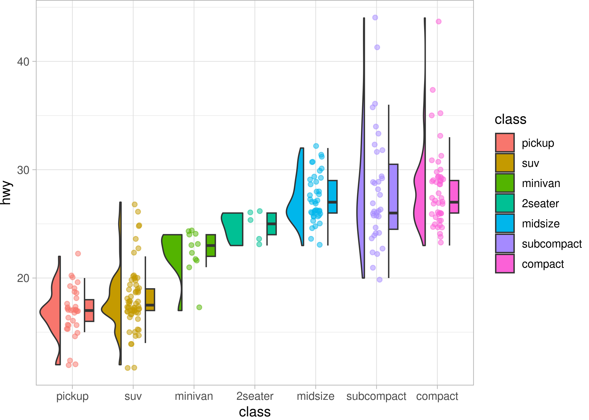
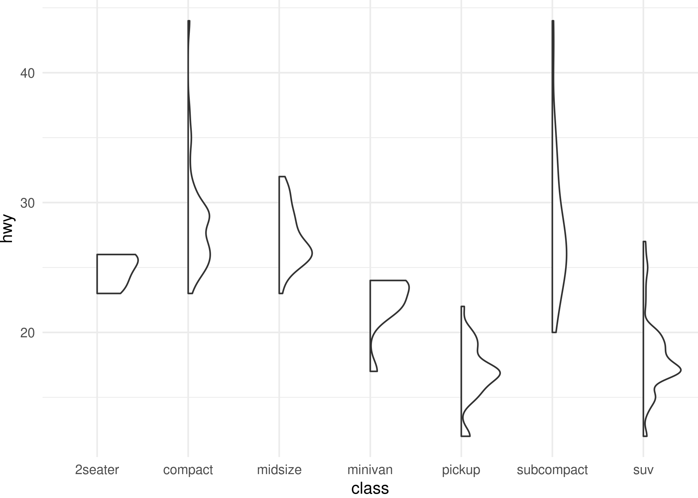
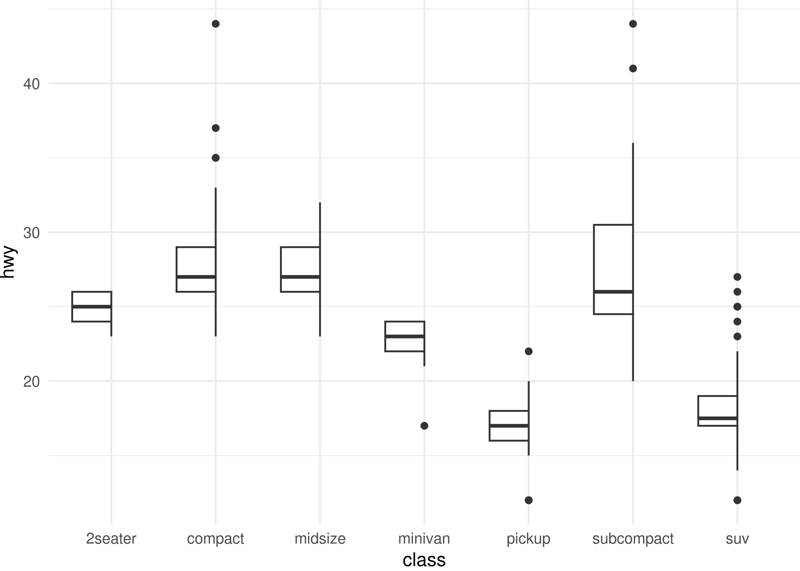
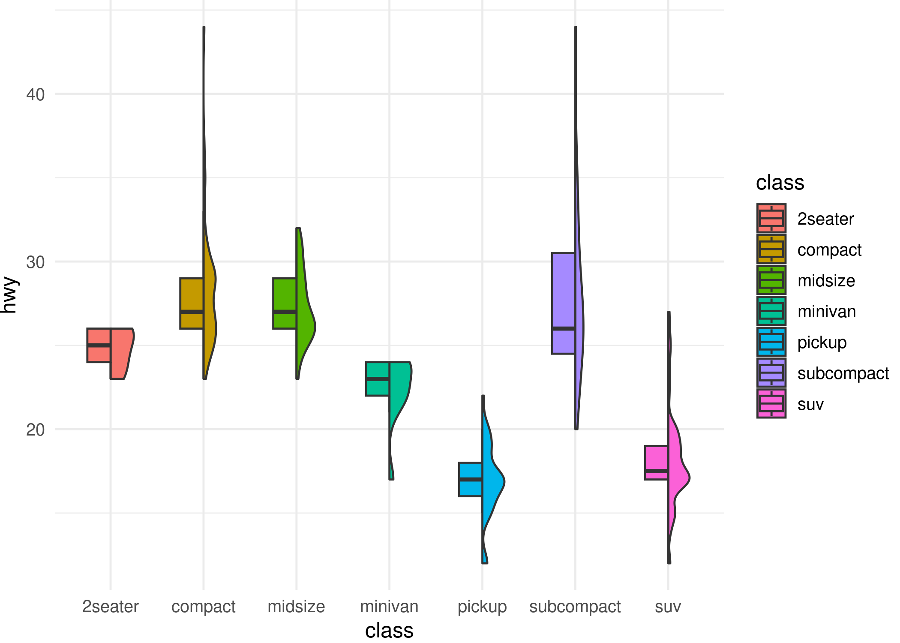

# `ggviolinbox`: Half-Violin and Half-Boxplot Geoms for ggplot2

The `ggviolinbox` package extends `ggplot2` by providing custom geoms for creating half-violin plots, half-boxplots, and combinations of both. These functions are useful for visualizing distributions and comparisons in a compact and elegant way.

---

## Installation

You can install the `ggviolinbox` package from GitHub using the `devtools` package:

```r
if(!require(devtools)) install.packages("devtools")
devtools::install_github("dsmutin/ggviolinbox")
```

---

## Example

```r 
library(ggplot2)
library(ggviolinbox)
ggplot(
    mutate(mpg, class = forcats::fct_reorder(class, hwy, .fun = mean)),
    aes(class, hwy, fill = class)
  ) +
  geom_halfboxplot(panel = "right", outliers = F, position = position_nudge(x = .2), width = .3) +
  geom_jitter(aes(color = class), alpha = .5, position = position_jitter(.1)) +
  geom_halfviolin(panel = "left", position = position_nudge(x = -.2), width = .7) +
  theme_light()
```
*Raincloud plots are not supported directly because of the ***ggplot2*** logic, but you can construct them with* `geom_violinbox() + geom_jitter() +coord_flip()` 



---

## Functions

The package provides the following functions:

1. **`geom_halfviolin()`**: Creates a half-violin plot (mirrored density plot).
2. **`geom_halfboxplot()`**: Creates a half-boxplot (mirrored boxplot).
3. **`geom_violinboxplot()`**: Combines a half-violin and a half-boxplot into a single plot.
4. **`ggviolinbox()`**: A convenience wrapper for `geom_violinbox()`.

---

## Usage

### 1. `geom_halfviolin()`
Creates a half-violin plot. Use the `panel` parameter to specify which side to display.

```r
library(ggplot2)
library(ggviolinbox)

ggplot(mpg, aes(class, hwy)) +
  geom_halfviolin(panel = "right") +
  theme_minimal()
```



---

### 2. `geom_halfboxplot()`
Creates a half-boxplot. Use the `panel` parameter to specify which side to display.

```r
ggplot(mpg, aes(class, hwy)) +
  geom_halfboxplot(panel = "left") +
  theme_minimal()
```



---

### 3. `geom_violinboxplot()`
Combines a half-violin and a half-boxplot. Use the `boxplot` and `violinplot` parameters to specify which side each geom appears on.

```r
ggplot(mpg, aes(class, hwy, fill = class)) +
  geom_violinboxplot(boxplot = "left", violinplot = "right", 
    outliers = F, width = .5) +
  theme_minimal()
```



---

### 4. `ggviolinbox()`
A convenience wrapper for `geom_violinbox()`.

```r
ggviolinbox(boxplot = "left", violinplot = "right") +
  theme_minimal()
```

---

## Contributing

Contributions are welcome! If you find a bug or have a feature request, please open an issue on GitHub. If you'd like to contribute code, fork the repository and submit a pull request.

---

## License

This package is licensed under the MIT License. See the `LICENSE` file for details.

---

## Acknowledgments

- Inspired by the `ggridges`, `ggExtra` and `ggplot2` packages.
- Many thanks to the `introindataviz` package for previous implementations.

---

## Contact

For questions or feedback, please contact D. Smutin at `dvsmutin@gmail.com`.
