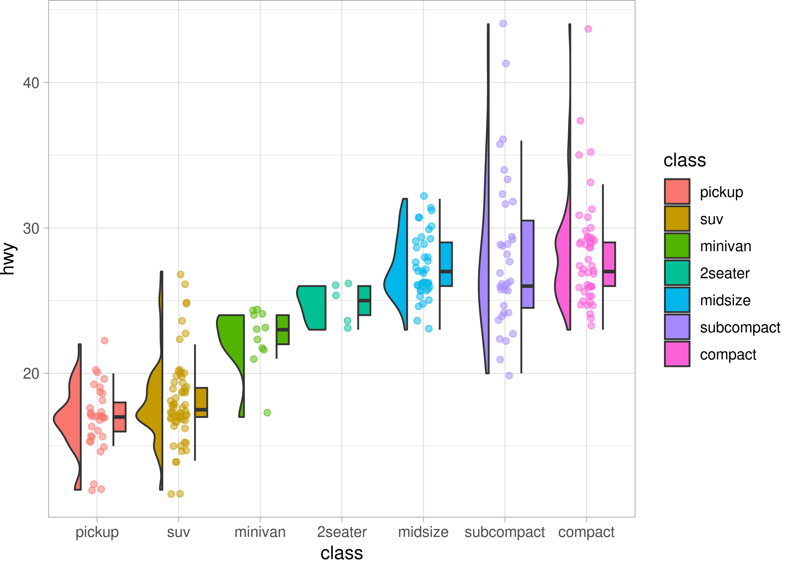
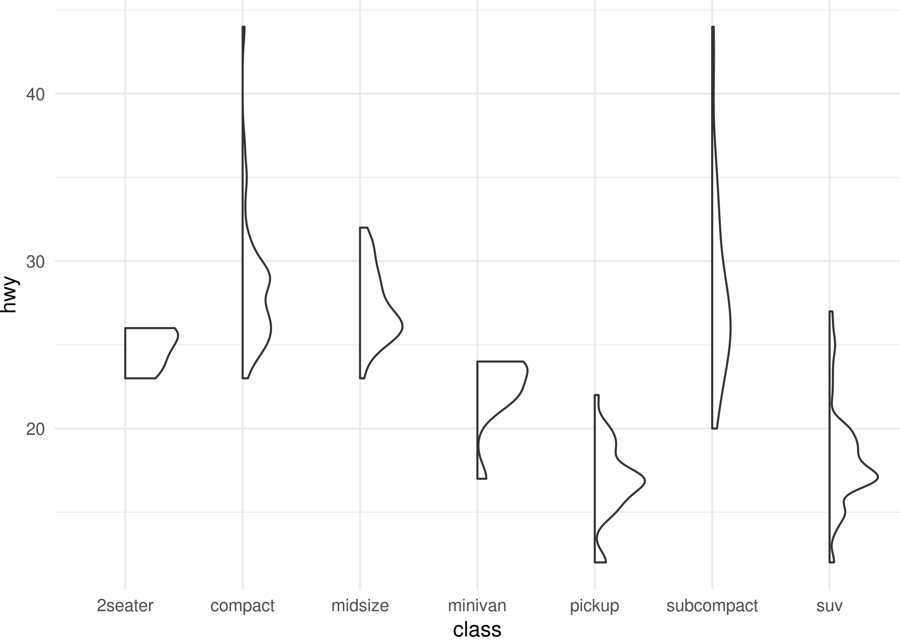
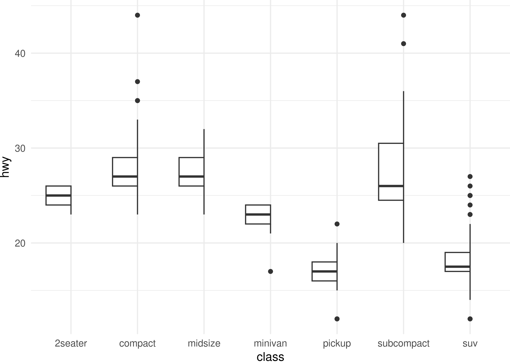
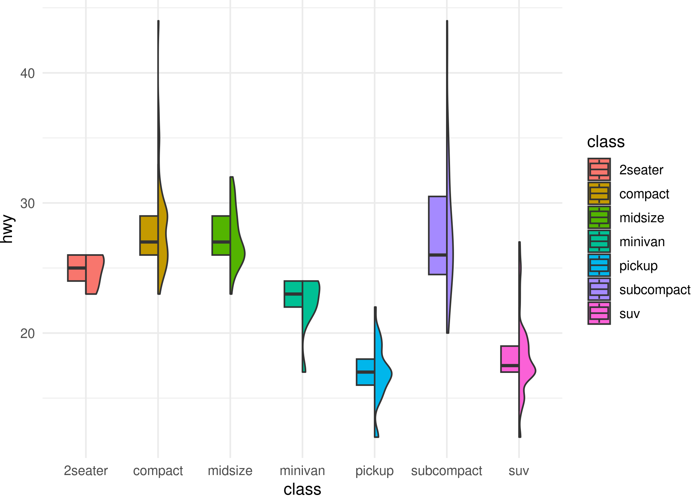

# `ggviolinbox`: Half-Violin and Half-Boxplot Geoms for ggplot2

[](https://github.com/dsmutin/ggviolinbox/actions/workflows/R-package.yaml)

The `ggviolinbox` is the `ggplot2` extention with half violins and boxplots geoms (similar to python matplotlib boxplot/violinplot with side parameter)

---

## Installation

You can install the `ggviolinbox` package from GitHub using the `devtools` package:

```r
if(!require(devtools)) install.packages("devtools")
devtools::install_github("dsmutin/ggviolinbox")
```

---

## Example

```r 
library(ggplot2)
library(ggviolinbox)
ggplot(
    mutate(mpg, class = forcats::fct_reorder(class, hwy, .fun = mean)),
    aes(class, hwy, fill = class)
  ) +
  geom_halfboxplot(panel = "right", outliers = F, position = position_nudge(x = .2), width = .3) +
  geom_jitter(aes(color = class), alpha = .5, position = position_jitter(.1)) +
  geom_halfviolin(panel = "left", position = position_nudge(x = -.2), width = .7) +
  theme_light()
```
*Raincloud-style plots can use native y orientation (no `coord_flip()` required):*

```r
ggplot(mpg, aes(hwy, class, fill = class)) +
  geom_violinboxplot(boxplot = "bottom", violinplot = "top", outliers = FALSE, nudge = 0.1) +
  geom_jitter(aes(color = class), height = 0.1, width = 0, alpha = 0.4) +
  theme_light()
```



---

## Functions

The package provides the following functions:

1. **`geom_halfviolin()`**: Creates a half-violin plot (mirrored density plot).
2. **`geom_halfboxplot()`**: Creates a half-boxplot (mirrored boxplot).
3. **`geom_violinboxplot()`**: Combines a half-violin and a half-boxplot into a single plot.
4. **`ggviolinbox()`**: A convenience wrapper for `ggplot()+geom_violinboxplot()`.

---

## Usage

In general, all parameters except of `panel` is inhereted from **ggplot2** `geom_violin` or `geom_boxplot`
- `panel` corresponds to the geom side (`"left"` / `"right"` when groups are on x, `"bottom"` / `"top"` when groups are on y). `"left"` aliases `"bottom"` and `"right"` aliases `"top"` in the flipped orientation.
- `orientation` follows ggplot2 (`NA` auto-detects, or `"x"` / `"y"`).
- in `geom_violinboxplot()`, `nudge` shifts the two halves along the grouping axis without replacing `position`.

### 1. `geom_halfviolin()`
Creates a half-violin plot. Use the `panel` parameter to specify which side to display.

```r
library(ggplot2)
library(ggviolinbox)

ggplot(mpg, aes(class, hwy)) +
  geom_halfviolin(panel = "right") +
  theme_minimal()

ggplot(mpg, aes(hwy, class)) +
  geom_halfviolin(panel = "top") +
  theme_minimal()
```



---

### 2. `geom_halfboxplot()`
Creates a half-boxplot. Use the `panel` parameter to specify which side to display.

```r
ggplot(mpg, aes(class, hwy)) +
  geom_halfboxplot(panel = "left") +
  theme_minimal()

ggplot(mpg, aes(hwy, class)) +
  geom_halfboxplot(panel = "bottom") +
  theme_minimal()
```



---

### 3. `geom_violinboxplot()`
Combines a half-violin and a half-boxplot. Use the `boxplot` and `violinplot` parameters to specify which side each geom appears on.

```r
ggplot(mpg, aes(class, hwy, fill = class)) +
  geom_violinboxplot(boxplot = "left", violinplot = "right", 
    outliers = F, width = .5) +
  theme_minimal()

ggplot(mpg, aes(hwy, class, fill = class)) +
  geom_violinboxplot(boxplot = "bottom", violinplot = "top",
    outliers = FALSE, width = 0.5) +
  theme_minimal()
```



---

### 4. `ggviolinbox()`
A convenience wrapper for `geom_violinboxplot()`.

```r
ggviolinbox(data = mpg, mapping = aes(class, hwy),
            boxplot = "left", violinplot = "right") +
  theme_minimal()
```

---

## Contributing

Contributions are welcome! If you find a bug or have a feature request, please open an issue on GitHub. If you'd like to contribute code, fork the repository and submit a pull request.

---

## License

This package is licensed under the MIT License. See the `LICENSE` file for details.

---

## Acknowledgments

- Inspired by the `ggridges`, `ggExtra` and `ggplot2` packages.
- Many thanks to the `introindataviz` package for previous implementations.

---

## Contact

For questions or feedback, please contact D. Smutin at `dvsmutin@gmail.com`.

---

## Compatibility

- Requires **ggplot2** >= 3.4.0 (orientation / `flip_data()`).
- Tested with **ggplot2** 4.0.3 and **R** 4.3.3.
