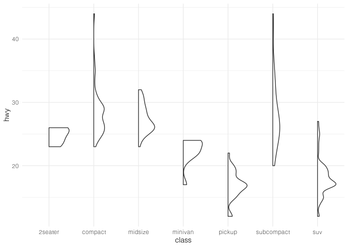
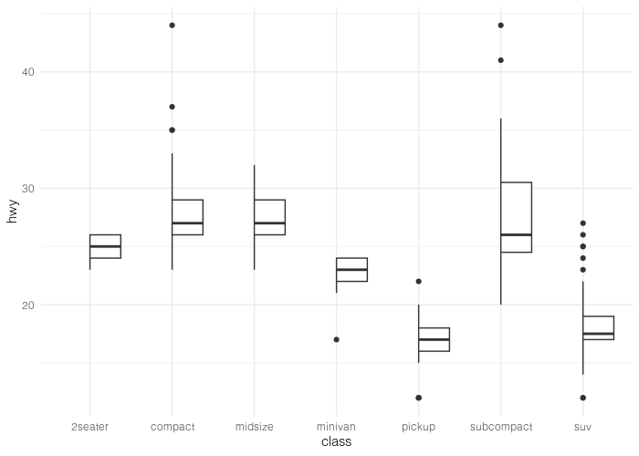

# `ggviolinbox`: Half-Violin and Half-Boxplot Geoms for ggplot2

The `ggviolinbox` package extends `ggplot2` by providing custom geoms for creating half-violin plots, half-boxplots, and combinations of both. These functions are useful for visualizing distributions and comparisons in a compact and elegant way.

---

## Installation

You can install the `ggviolinbox` package from GitHub using the `devtools` package:

```r
install.packages("devtools")
devtools::install_github("dsmutin/ggviolinbox")
```

---

## Functions

The package provides the following functions:

1. **`geom_halfviolin()`**: Creates a half-violin plot (mirrored density plot).
2. **`geom_halfboxplot()`**: Creates a half-boxplot (mirrored boxplot).
3. **`geom_violinboxplot()`**: Combines a half-violin and a half-boxplot into a single plot.
4. **`ggviolinbox()`**: A convenience wrapper for `geom_violinbox()`.

---

## Usage

### 1. `geom_halfviolin()`
Creates a half-violin plot. Use the `panel` parameter to specify which side to display.

```r
library(ggplot2)
library(ggviolinbox)

ggplot(mpg, aes(class, hwy)) +
  geom_halfviolin(panel = "right") +
  theme_minimal()
```



---

### 2. `geom_halfboxplot()`
Creates a half-boxplot. Use the `panel` parameter to specify which side to display.

```r
ggplot(mpg, aes(class, hwy)) +
  geom_halfboxplot(panel = "left") +
  theme_minimal()
```



---

### 3. `geom_violinboxplot()`
Combines a half-violin and a half-boxplot. Use the `boxplot` and `violinplot` parameters to specify which side each geom appears on.

```r
ggplot(mpg, aes(class, hwy)) +
  geom_violinboxplot(boxplot = "left", violinplot = "right") +
  theme_minimal()
```


---

### 4. `ggviolinbox()`
A convenience wrapper for `geom_violinbox()`.

```r
ggviolinbox(boxplot = "left", violinplot = "right") +
  theme_minimal()
```

---

## Examples

### Example 1: Half-Violin Plot
```r
ggplot(mpg, aes(class, hwy)) +
  geom_halfviolin(panel = "right", fill = "skyblue") +
  labs(title = "Half-Violin Plot", x = "Class", y = "Highway MPG") +
  theme_minimal()
```

### Example 2: Half-Boxplot
```r
ggplot(mpg, aes(class, hwy)) +
  geom_halfboxplot(panel = "left", fill = "lightgreen") +
  labs(title = "Half-Boxplot", x = "Class", y = "Highway MPG") +
  theme_minimal()
```

### Example 3: Violin-Boxplot Combination
```r
ggplot(mpg, aes(class, hwy)) +
  geom_violinboxplot(boxplot = "left", violinplot = "right", 
                 box_fill = "lightgreen", violin_fill = "skyblue") +
  labs(title = "Violin-Boxplot Combination", x = "Class", y = "Highway MPG") +
  theme_minimal()
```

---

## Parameters

### `geom_halfviolin()`
- `panel`: Specifies which side to display (`"left"` or `"right"`).
- All other parameters are inherited from `ggplot2::geom_violin()`.

### `geom_halfboxplot()`
- `panel`: Specifies which side to display (`"left"` or `"right"`).
- All other parameters are inherited from `ggplot2::geom_boxplot()`.

### `geom_violinboxplot()`
- `boxplot`: Specifies which side the boxplot appears on (`"left"` or `"right"`).
- `violinplot`: Specifies which side the violin plot appears on (`"left"` or `"right"`).
- All other parameters are inherited from `ggplot2::geom_violin()` and `ggplot2::geom_boxplot()`.

### `ggviolinbox()`
- Same parameters as `geom_violinboxplot()`.

---

## Contributing

Contributions are welcome! If you find a bug or have a feature request, please open an issue on GitHub. If you'd like to contribute code, fork the repository and submit a pull request.

---

## License

This package is licensed under the MIT License. See the `LICENSE` file for details.

---

## Acknowledgments

- Inspired by the `ggridges`, ``ggExtra` and `ggplot2` packages.
- Many thanks to the `introindataviz` package for previous implementations.

---

## Contact

For questions or feedback, please contact D. Smutin at `dvsmutin@gmail.com`.
